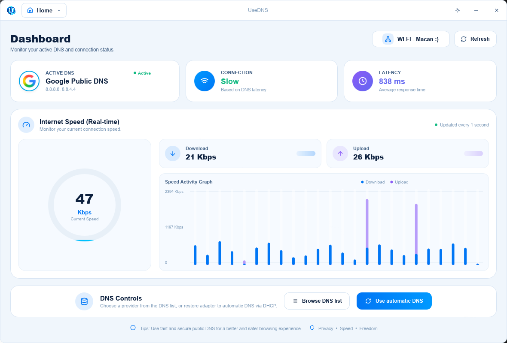

<p align="center">
  
</p>

<h1 align="center">UseDNS</h1>

<p align="center"><strong>Choose. Switch. Connect.</strong></p>

UseDNS is a lightweight desktop utility for discovering, comparing, and applying DNS resolvers without manually editing Windows network settings. It is built with [Rust](https://www.rust-lang.org/) and [Slint](https://slint.dev/).

<p align="center">
  
</p>

> [!NOTE]
> UseDNS is currently an MVP. DNS changes are supported on Windows; additional platform backends are planned.

## Highlights

- Detect active network adapters and their current DNS configuration
- Compare curated public DNS providers by purpose, not raw IP addresses
- Apply a provider through a guided dialog: choose a protection profile, then IPv4 (recommended), IPv6, or both
- See which DNS is in use on the dashboard (provider logo) and in the catalog
- Create, update, and remove custom DNS profiles
- Restore automatic DNS configuration from DHCP
- Monitor resolver reachability, approximate latency, and live adapter throughput
- Switch between English and Indonesian, with English as the default
- Choose a glass-inspired light or dark appearance, or follow the Windows theme
- Display speed in Kbps (default) or Mbps
- Keep preferences and custom profiles on the local device

## Included DNS Providers

| Provider          | Primary benefit                      | Profiles | IPv4 | IPv6 |
| ----------------- | ------------------------------------ | :------: | :--: | :--: |
| Cloudflare        | Performance and privacy              |   Yes    | Yes  | Yes  |
| Google Public DNS | Reliability and global availability  |   Yes    | Yes  | Yes  |
| Quad9             | Malware and phishing protection      |   Yes    | Yes  | Yes  |
| AdGuard DNS       | Ad and tracker filtering             |   Yes    | Yes  | Yes  |
| CleanBrowsing     | Family-safe filtering                |   Yes    | Yes  | Yes  |
| Control D         | Ads, malware, and productivity       |   Yes    | Yes  | Yes  |
| NextDNS           | Cloud privacy                        |   Yes    | Yes  | Yes  |
| OpenDNS           | Enterprise security and FamilyShield |   Yes    | Yes  | Yes  |

Built-in providers are read-only so their verified configuration stays intact. User-created profiles remain fully editable. The catalog hides raw IPv4 and IPv6 addresses; those details are applied in the background after the user picks a profile and address mode.

## Requirements

- Windows 10 or Windows 11
- PowerShell with the `DnsClient` module
- Administrator privileges when applying or resetting DNS
- Rust 1.92 or newer when building from source

Reading network status does not require elevation. Windows only requires Administrator privileges when UseDNS writes DNS settings.

## Getting Started

Clone the repository and enter its directory:

```sh
git clone https://github.com/x-labs-myid/UseDNS.git
cd UseDNS
```

Run the development build:

```sh
cargo run
```

To apply or reset DNS, launch the terminal as **Administrator** before running the command.

Create an optimized executable:

```sh
cargo build --release
```

The resulting executable is written to `target/release/usedns.exe`. Release builds use thin LTO and stripped symbols. Development builds omit debug info so `target/` stays smaller; run `cargo clean` if an old debug tree is still large.

UI icons use [Lucide](https://lucide.dev/) through [`lucide-slint`](https://github.com/cnlancehu/lucide-slint). Provider brand marks are official logos under `.assets/icons/dns-providers/`.

## Releases

GitHub Actions builds Windows, Linux, and macOS binaries when you **push a version tag**. Versioning starts at **1.0.0** and follows [SemVer](https://semver.org/).

### Tag format

The tag must start with `v`, then `MAJOR.MINOR.PATCH`. Optional pre-release suffixes: `-alpha`, `-beta`, or `-rc`, with an optional `.N`.

| Channel             | Tag examples                     | GitHub Release            |
| ------------------- | -------------------------------- | ------------------------- |
| Alpha               | `v1.0.0-alpha`, `v1.0.0-alpha.1` | Marked as **pre-release** |
| Beta                | `v1.0.0-beta`, `v1.0.0-beta.1`   | Marked as **pre-release** |
| Release candidate   | `v1.0.0-rc.1`                    | Marked as **pre-release** |
| Stable / production | `v1.0.0`, `v1.1.0`, `v1.0.1`     | Latest stable release     |

Invalid tags (for example `v1`, `1.0.0`, or `v1.0.0-preview`) are rejected by the workflow.

### Publish a build

From the repository root, on the commit you want to ship:

```sh
git tag v1.0.0-alpha.1
git push origin v1.0.0-alpha.1
```

Stable production:

```sh
git tag v1.0.0
git push origin v1.0.0
```

The workflow (`.github/workflows/release.yml`) then:

1. Validates the tag and classifies the channel (alpha, beta, rc, or stable).
2. Builds `--release` on Windows x64, Linux x64, and macOS. The Intel Mac binary is cross-compiled on Apple Silicon so the job does not wait on the old Intel runners.
3. Packages installable artifacts and attaches them with `SHA256SUMS.txt` to a GitHub Release.

| File                                    | What you get                                                    |
| --------------------------------------- | --------------------------------------------------------------- |
| `usedns-1.0.0-windows-x86_64-setup.exe` | Windows installer (Program Files, Start Menu, desktop shortcut) |
| `usedns-1.0.0-linux-x86_64.tar.gz`      | Linux archive                                                   |
| `usedns_1.0.0_amd64.deb`                | Debian/Ubuntu package (`sudo apt install ./usedns_*.deb`)       |
| `usedns-1.0.0-macos-aarch64.zip`        | `UseDNS.app` for Apple Silicon                                  |
| `usedns-1.0.0-macos-x86_64.zip`         | `UseDNS.app` for Intel Macs                                     |

On Windows, run the **setup** file, not a raw `.exe`. After install, start UseDNS from the Start Menu. Changing DNS still needs Administrator rights.

DNS apply/reset remains a Windows feature in this MVP. Linux and macOS builds produce the UI; changing system DNS on those platforms is not implemented yet.

## Usage

1. Open **Home** and review the active adapter, Active DNS card (provider logo and name), and connection status.
2. Open **DNS providers** from the title-bar menu.
3. Filter by purpose (privacy, speed, security, ad blocking) or search by name.
4. Select **Use DNS** on a provider.
5. In the apply dialog, pick a protection profile if the provider has more than one.
6. Choose how to apply it: **IPv4** (recommended), **IPv6**, or **both**.
7. Confirm **Apply DNS**. The catalog marks the provider **In use**, and Home shows its logo.
8. If connectivity is affected, return to **Home** or **Policy** and restore automatic DNS.

Custom resolvers such as Pi-hole, AdGuard Home, private DNS servers, and internal network resolvers can be managed from **Custom DNS**.

## Architecture

```text
UseDNS/
├── .assets/
│   ├── UseDNS.png
│   └── icons/dns-providers/   # Official provider logos
├── src/
│   ├── main.rs                # Application state and UI callbacks
│   ├── models.rs              # DNS provider and profile model, validation
│   ├── storage.rs             # Local settings persistence
│   └── system.rs              # Windows adapter and DNS operations
├── ui/
│   ├── components/
│   │   ├── common.slint       # Shared buttons, badges, provider icons
│   │   ├── sidebar.slint      # Optional navigation
│   │   └── titlebar.slint     # Frameless window chrome and page menu
│   ├── pages/
│   │   ├── home.slint
│   │   ├── providers.slint
│   │   ├── custom-dns.slint
│   │   ├── policy.slint
│   │   └── settings.slint
│   ├── app-window.slint       # Composition root and Rust callback surface
│   ├── theme.slint            # Shared light/dark design tokens
│   └── types.slint            # UI-facing data structures
├── build.rs                   # UI compilation, Lucide, Windows resources
└── Cargo.toml
```

UseDNS calls the Windows `Set-DnsClientServerAddress` PowerShell command to apply and reset DNS settings. Platform-specific operations are kept separate from the provider model and UI.

## Data and Privacy

UseDNS does not operate a DNS resolver and does not inspect, record, or sell DNS queries. Queries are handled directly by the provider selected by the user. Each provider has independent logging, filtering, privacy, and retention policies.

Custom DNS profiles and language preferences are serialized to the operating system's local application configuration directory. UseDNS does not upload this data.

The connection indicator checks resolver reachability and approximate ping latency. It is not a bandwidth test and does not send test files to a third-party speed-testing service.

## Documentation

The complete MVP product specification, implementation inventory, known limitations, acceptance checklist, and roadmap are available in [`docs/spec/MVP_SPECIFICATION.md`](docs/spec/MVP_SPECIFICATION.md).

## Development

Format the project and run its tests before submitting a change:

```sh
cargo fmt --all -- --check
cargo test
```

The current tests cover validation of bundled DNS profiles and rejection of addresses with an incorrect IP version.

## Roadmap

Potential follow-up work includes:

- Native elevation flow for DNS operations
- Linux and macOS DNS backends
- DNS response benchmarking and recommendation ranking
- Confirmation and rollback of the previous adapter configuration
- Signed Windows installers and release automation

## Disclaimer

UseDNS is an independent utility and is not affiliated with, endorsed by, or sponsored by any listed DNS provider. Provider names and trademarks belong to their respective owners.

Changing DNS does not make a connection anonymous or completely private. Availability and performance vary by ISP, location, selected provider, and network conditions.

## License

UseDNS is available under the [MIT License](LICENSE).
