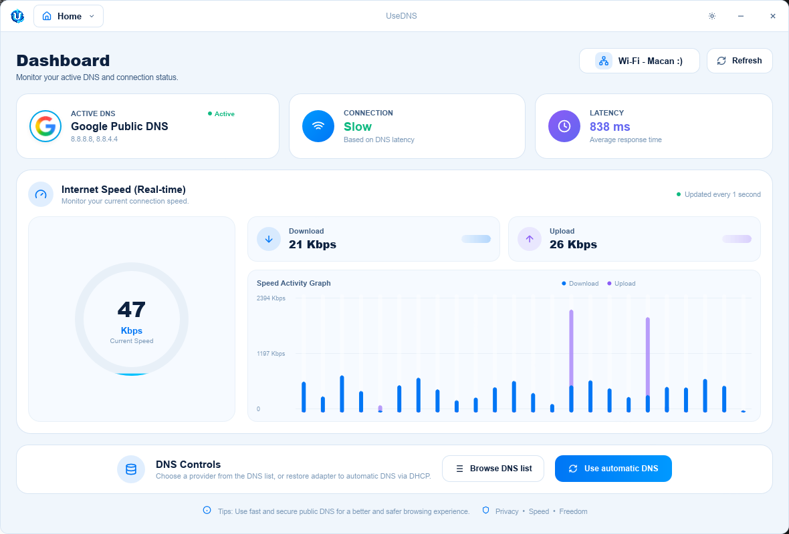

<p align="center">
  
</p>

<h1 align="center">UseDNS</h1>

<p align="center"><strong>Choose. Switch. Connect.</strong></p>

UseDNS is a lightweight desktop utility for discovering, comparing, and applying DNS resolvers without manually editing network settings. It is built with [Rust](https://www.rust-lang.org/) and [Slint](https://slint.dev/).

<p align="center">
  
</p>

> [!NOTE]
> UseDNS is currently an MVP. DNS changes support Windows, Linux with NetworkManager, and macOS network services. Linux/macOS backends still need validation on their respective systems.

## Highlights

- Detect active network adapters and their current DNS configuration
- Compare curated public DNS providers by purpose, not raw IP addresses
- Apply a provider through a guided dialog: choose a protection profile, then IPv4 (recommended), IPv6, or both
- See which DNS is in use on the dashboard (provider logo) and in the catalog
- Create, update, and remove custom DNS profiles
- Restore automatic DNS configuration from DHCP
- Monitor resolver reachability, approximate latency, and live adapter throughput
- Switch between English and Indonesian, with English as the default
- Choose a glass-inspired light or dark appearance, or follow the Windows theme
- Adapt speed units automatically: Kbps → Mbps → Gbps at each decimal 1000 boundary
- Rate successful DNS responses from 1 to 5 stars, with unmeasured results left unrated
- Read the built-in bilingual **Guide & FAQ** by topic
- Keep preferences and custom profiles on the local device
- Choose **Quit**, **Background**, or **Cancel** when closing the main window
- Keep the tray preview visible while hovering over either the icon or the preview
- Opt into **Start with Windows** in Settings (disabled by default)
- Compare real DNS response times with **Network booster**, then review before applying

## Included DNS Providers

| Provider          | Primary benefit                      | Profiles | IPv4 | IPv6 |
| ----------------- | ------------------------------------ | :------: | :--: | :--: |
| Cloudflare        | Performance and privacy              |   Yes    | Yes  | Yes  |
| Google Public DNS | Reliability and global availability  |   Yes    | Yes  | Yes  |
| Quad9             | Malware and phishing protection      |   Yes    | Yes  | Yes  |
| AdGuard DNS       | Ad and tracker filtering             |   Yes    | Yes  | Yes  |
| CleanBrowsing     | Family-safe filtering                |   Yes    | Yes  | Yes  |
| Control D         | Ads, malware, and productivity       |   Yes    | Yes  | Yes  |
| NextDNS           | Cloud privacy                        |   Yes    | Yes  | Yes  |
| OpenDNS           | Enterprise security and FamilyShield |   Yes    | Yes  | Yes  |

Built-in providers are read-only so their verified configuration stays intact. User-created profiles remain fully editable. The catalog hides raw IPv4 and IPv6 addresses; those details are applied in the background after the user picks a profile and address mode.

## Requirements

- Windows 10/11 with PowerShell `DnsClient`, Linux with NetworkManager (`nmcli`, `pkexec`, and a graphical authorization agent), or macOS with `networksetup`
- Authorization when applying/resetting DNS or restarting WinNAT
- libcurl with system TLS support for speedtest; `lsof` and `ps` for Unix port inspection
- Rust 1.92 or newer when building from source

Reading network status does not require elevation. DNS writes and Windows WinNAT restart request elevated access; process termination respects the current user's permissions.

## Getting Started

Clone the repository and enter its directory:

```sh
git clone https://github.com/x-labs-myid/UseDNS.git
cd UseDNS
```

Run the development build:

```sh
cargo run
```

DNS changes request platform authorization when needed; the main application can run as a regular user.

Create an optimized executable:

```sh
cargo build --release
```

The resulting executable is written to `target/release/usedns.exe`. Release builds use thin LTO and stripped symbols. Development builds omit debug info so `target/` stays smaller; run `cargo clean` if an old debug tree is still large.

UI icons use [Lucide](https://lucide.dev/) through [`lucide-slint`](https://github.com/cnlancehu/lucide-slint). Provider brand marks are official logos under `.assets/icons/dns-providers/`.

## Releases

GitHub Actions builds Windows, Linux, and macOS binaries when you **push a version tag**. Versioning starts at **1.0.0** and follows [SemVer](https://semver.org/).

### Tag format

The tag must start with `v`, then `MAJOR.MINOR.PATCH`. Optional pre-release suffixes: `-alpha`, `-beta`, or `-rc`, with an optional `.N`.

| Channel             | Tag examples                     | GitHub Release            |
| ------------------- | -------------------------------- | ------------------------- |
| Alpha               | `v1.0.0-alpha`, `v1.0.0-alpha.1` | Marked as **pre-release** |
| Beta                | `v1.0.0-beta`, `v1.0.0-beta.1`   | Marked as **pre-release** |
| Release candidate   | `v1.0.0-rc.1`                    | Marked as **pre-release** |
| Stable / production | `v1.0.0`, `v1.1.0`, `v1.0.1`     | Latest stable release     |

Invalid tags (for example `v1`, `1.0.0`, or `v1.0.0-preview`) are rejected by the workflow.

### Publish a build

From the repository root, on the commit you want to ship:

```sh
git tag v1.0.0-alpha.1
git push origin v1.0.0-alpha.1
```

Stable production:

```sh
git tag v1.0.0
git push origin v1.0.0
```

The workflow (`.github/workflows/release.yml`) then:

1. Validates the tag and classifies the channel (alpha, beta, rc, or stable).
2. Builds `--release` on Windows x64, Linux x64, and macOS. The Intel Mac binary is cross-compiled on Apple Silicon so the job does not wait on the old Intel runners.
3. Packages installable artifacts and attaches them with `SHA256SUMS.txt` to a GitHub Release.

| File                                    | What you get                                                 |
| --------------------------------------- | ------------------------------------------------------------ |
| `usedns-1.0.0-windows-x86_64-setup.exe` | Windows NSIS installer with Start Menu and desktop shortcuts |
| `usedns-1.0.0-windows-x86_64.msi`       | Windows Installer package for managed deployment             |
| `usedns-1.0.0-linux-x86_64.tar.gz`      | Portable Linux archive                                       |
| `usedns_1.0.0_amd64.deb`                | Debian/Ubuntu package (`sudo apt install ./usedns_*.deb`)    |
| `usedns-1.0.0-x86_64.rpm`               | Fedora/RHEL/openSUSE package                                 |
| `usedns-1.0.0-macos-aarch64.dmg`        | macOS disk image for Apple Silicon                           |
| `usedns-1.0.0-macos-x86_64.dmg`         | macOS disk image for Intel Macs                              |
| `usedns-1.0.0-macos-aarch64.zip`        | Zipped `UseDNS.app` for Apple Silicon                        |
| `usedns-1.0.0-macos-x86_64.zip`         | Zipped `UseDNS.app` for Intel Macs                           |

On Windows, run the **setup** file, not a raw `.exe`. After install, start UseDNS from the Start Menu. Changing DNS still needs Administrator rights.

DNS apply/reset uses the existing Windows backend, NetworkManager (`nmcli` and `pkexec`) on Linux, and `networksetup` with the macOS administrator prompt. Linux distributions without NetworkManager are unsupported. Plain DNS is available on Linux/macOS; the encrypted DNS option remains Windows-only.

## Usage

1. Open **Home** and review the active adapter, Active DNS card (provider logo and name), and connection status.
2. Open **DNS providers** from the title-bar menu.
3. Filter by purpose (privacy, speed, security, ad blocking) or search by name.
4. Select **Use DNS** on a provider.
5. In the apply dialog, pick a protection profile if the provider has more than one.
6. Choose how to apply it: **IPv4** (recommended), **IPv6**, or **both**.
7. Confirm **Apply DNS**. The catalog marks the provider **In use**, and Home shows its logo.
8. If connectivity is affected, return to **Home** or **Policy** and restore automatic DNS.

Custom resolvers such as Pi-hole, AdGuard Home, private DNS servers, and internal network resolvers can be managed from **Custom DNS**.

## Architecture

```text
UseDNS/
├── .assets/
│   ├── UseDNS.png
│   └── icons/dns-providers/   # Official provider logos
├── src/
│   ├── main.rs                # Application state and UI callbacks
│   ├── models.rs              # DNS provider and profile model, validation
│   ├── storage.rs             # Local settings persistence
│   └── system.rs              # Windows adapter and DNS operations
├── ui/
│   ├── components/
│   │   ├── common.slint       # Shared buttons, badges, provider icons
│   │   ├── sidebar.slint      # Optional navigation
│   │   └── titlebar.slint     # Frameless window chrome and page menu
│   ├── pages/
│   │   ├── home.slint
│   │   ├── providers.slint
│   │   ├── custom-dns.slint
│   │   ├── policy.slint
│   │   └── settings.slint
│   ├── app-window.slint       # Composition root and Rust callback surface
│   ├── theme.slint            # Shared light/dark design tokens
│   └── types.slint            # UI-facing data structures
├── build.rs                   # UI compilation, Lucide, Windows resources
└── Cargo.toml
```

UseDNS calls the Windows `Set-DnsClientServerAddress` PowerShell command to apply and reset DNS settings. Platform-specific operations are kept separate from the provider model and UI.

## Data and Privacy

### Background mode, Windows startup, and Network booster

Closing the main window asks whether to quit or keep UseDNS running in the system tray. Background mode is offered only when the tray is available. The preview follows the actual cursor position and disappears about 150–200 ms after leaving both the icon and preview, allowing time to cross the gap between them. Hovering the tray shows a non-activating preview without a taskbar button; only the main window appears in the taskbar.

**Settings → Start with Windows** registers the current executable for the current user's Windows sign-in. It is off by default, requires no administrator privileges, and uses `--background` so the main window stays hidden when a tray is available. Turning it off removes UseDNS's entry. Keep the executable at the same location after enabling it; disable startup before uninstalling a portable copy.

**DNS Providers → Start scan** sends three ordinary IPv4 DNS queries (`example.com`, `www.microsoft.com`, and `www.cloudflare.com`) to the active IPv4 resolver and each bundled provider's default primary IPv4 resolver. Identical addresses are tested once. Tests run in the background, with at most four candidates at a time and a 700 ms timeout per query. Results favor successful responses, then median latency; candidates need at least two successful responses to qualify.

**Review recommendation** opens the existing provider/profile dialog. When the current DNS wins, the summary says no change is needed and **Review alternative** opens the best qualifying bundled alternative. If no alternative qualifies, no review action is offered. Ranked results show resolver addresses, median response time, and successful replies out of three. Leaving the page clears scan results and progress; updates from an older background scan are discarded, so returning starts with a fresh scan. DNS changes still require explicit Apply and Windows UAC. Default profiles may have different filtering from your current profile. This measures UDP DNS resolution, rather than encrypted DNS performance or bandwidth, and does not promise faster downloads. Windows already caches DNS answers; cache clearing is reserved for DNS changes rather than periodic optimization. See [Microsoft's DNS query and caching documentation](https://learn.microsoft.com/en-us/windows-server/networking/dns/queries-lookups), [Windows startup registration](https://learn.microsoft.com/windows/win32/setupapi/run-and-runonce-registry-keys), and [TCP tuning guidance](https://learn.microsoft.com/en-us/windows-server/networking/technologies/network-subsystem/net-sub-performance-tuning-nics).

UseDNS does not operate a DNS resolver and does not inspect, record, or sell DNS queries. Queries are handled directly by the provider selected by the user. Each provider has independent logging, filtering, privacy, and retention policies.

Custom DNS profiles and language preferences are serialized to the operating system's local application configuration directory. UseDNS does not upload this data.

The DNS response indicator sends an actual UDP DNS query to configured resolvers, including DNS proxies on home routers, and checks again every 15 seconds. It tries another test domain or a configured secondary resolver when needed. Latency is the successful DNS query's response time. Ratings use UseDNS's own guidance: 5 stars for ≤50 ms, 4 for 51–100 ms, 3 for 101–250 ms, 2 for 251–500 ms, and 1 for >500 ms. No verified response shows **Not measured** and empty stars, which does not establish that the internet is disconnected; UDP DNS can be blocked while encrypted DNS still works. The rating does not measure DoH latency, bandwidth, or overall connection stability. Background diagnostic failures do not generate operation-error toasts. Explicit **Test resolver** actions still report their result.

Each traffic reading now chooses its own unit: 999 Kbps stays in Kbps, 1000 Kbps becomes 1 Mbps, and 10792 Kbps becomes 10.79 Mbps. The center gauge and graph labels use the same decimal conversion, with Gbps from 1000 Mbps. Manual unit selection has been removed; older settings files still load and their obsolete `speed_unit` field is ignored. Traffic readings measure current adapter usage rather than maximum connection capacity.

## Documentation

Open **Guide & FAQ** from the application's navigation dropdown. The offline page supports English and Indonesian, topic filters, and expandable answers covering DNS profiles, protocols, DoH, custom DNS, DHCP, monitoring, ratings, booster, tray, startup, appearance, and troubleshooting. For background on encrypted DNS, see [Microsoft's DoH client documentation](https://learn.microsoft.com/en-us/windows-server/networking/dns/doh-client-support).

The complete MVP product specification, implementation inventory, known limitations, acceptance checklist, and roadmap are available in [`docs/spec/MVP_SPECIFICATION.md`](docs/spec/MVP_SPECIFICATION.md).

## Development

Format the project and run its tests before submitting a change:

```sh
cargo fmt --all -- --check
cargo test
```

Tests cover bundled profile validation, IP versions, tray hover transitions, DNS packet validation and a local UDP exchange, backward-compatible startup defaults, and recovery of interrupted/corrupt settings writes. Run `cargo clippy --all-targets -- -D warnings` for lint checks. Implementation findings and the manual Windows checklist are in [the code audit](docs/spec/CODE_AUDIT.md).

## Roadmap

Potential follow-up work includes:

- Native elevation flow for DNS operations
- Validate Linux and macOS DNS backends on physical systems
- DNS response benchmarking and recommendation ranking
- Confirmation and rollback of the previous adapter configuration
- Signed Windows installers and release automation

## Disclaimer

UseDNS is an independent utility and is not affiliated with, endorsed by, or sponsored by any listed DNS provider. Provider names and trademarks belong to their respective owners.

Changing DNS does not make a connection anonymous or completely private. Availability and performance vary by ISP, location, selected provider, and network conditions.

## License

UseDNS is available under the [MIT License](LICENSE).

## Network Tools

Open **Network Tools / Alat Jaringan** from navigation. These tools run only on explicit user actions:

- **Speedtest:** measures aggregate throughput to Cloudflare with four reusable parallel libcurl sessions, three seconds of warmup and ten seconds of measurement per direction. Request sizes adapt to connection speed; live byte measurements update approximately every 250 ms. Data consumption scales with speed and can reach gigabytes. HTTP latency is the median of six response samples after warmup, excluding connection setup; it includes server processing and is not ICMP ping. This is a Cloudflare throughput estimate, separate from DNS benchmarking, and does not implement Ookla's algorithm. Cancel stops all transfers; connection and request timeouts are five and twenty seconds. TLS verification remains enabled. Cloudflare sees your public IP and handles requests under its own policies. No history is stored.
- **Ports:** lists local TCP listeners and UDP endpoints, with PID and process name. Linux/macOS require `lsof`; processes hidden by OS permissions may not appear. The list loads when Network Tools opens; Refresh also runs in the background.
- **Stop process:** confirmation shows the selected process and explains that all its connections and unsaved work may be affected. UseDNS rechecks the selected port before requesting termination, blocks itself and low system PIDs, checks the process start time to detect PID reuse, and does not elevate this operation. Normal stop uses SIGTERM on Unix and taskkill without `/F` on Windows. **Force** has an additional warning and uses SIGKILL or taskkill `/F`; try normal stop first. Some processes require other permissions.
- **Restart WinNAT:** Windows-only, separate from process termination. Confirmation explains possible interruption to VM/container networking; UAC requests Administrator access. It stops then starts WinNAT and reports failures. It is not a universal fix for port conflicts and does not delete reserved port ranges.

Linux DNS uses the active NetworkManager connection UUID, changes DNS settings, and reapplies the device without restarting networking. If reapply fails, it attempts to restore the prior DNS settings and reports rollback failures. `pkexec` requires a working graphical authorization agent. macOS applies DNS to the selected active network service; automatic DNS display uses interface-scoped system resolvers, with DHCP IPv4 DNS as a fallback. Automatic reset clears manual DNS settings in both IP families. No backend overwrites `/etc/resolv.conf`.

Platform references: [NetworkManager settings](https://networkmanager.pages.freedesktop.org/NetworkManager/NetworkManager/nm-settings-nmcli.html), [Cloudflare speedtest endpoints](https://github.com/cloudflare/speedtest), [WinNAT](https://learn.microsoft.com/en-us/windows-server/virtualization/hyper-v/setup-nat-network).
